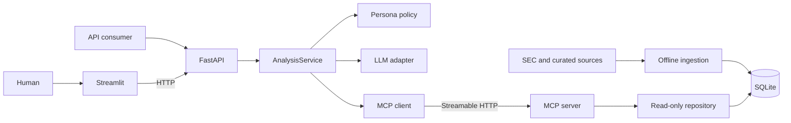

# FinAgent Assignment

A deliberately small, auditable financial-research agent scaffold. One bounded
analysis workflow supports Mutual Fund, Equity, and Private Equity personas
across Technology, Retail, and Logistics. Runtime data access is isolated behind
four typed Model Context Protocol (MCP) tools, and both the Streamlit UI and
external consumers use the same FastAPI contract.

This repository now contains an executable vertical slice: FastAPI calls the
bounded analysis service, which reaches a separate MCP Streamable HTTP process
and a read-only SQLite database. Gemini provides configurable planning and
synthesis, while a deterministic fake provider keeps offline tests reproducible.
Curated market and benchmark records remain a later milestone.

## Architecture



The full architecture, finite-state workflow, and API sequence are documented
in [docs/DESIGN.md](docs/DESIGN.md). Standalone Mermaid sources are under
[docs/diagrams](docs/diagrams), and the dependency-ordered delivery plan is in
[docs/IMPLEMENTATION_PLAN.md](docs/IMPLEMENTATION_PLAN.md).

## Design constraints

- One configurable agent workflow; no persona-specific implementations.
- Persona and sector are independent validated inputs.
- Streamlit calls FastAPI and contains no agent or database logic.
- The analysis service obtains runtime data only through MCP.
- Only `mcp_server/repository.py` and offline ingestion code access SQLite.
- No arbitrary/model-generated SQL and no runtime web scraping.
- Scope resolution occurs before synthesis, so unsupported companies return an
  honest `out_of_scope` result without calling the LLM.
- Model-produced findings must reference sources returned by MCP.

## Repository layout

```text
src/finagent/
  api/             FastAPI adapter and Problem Details errors
  config/          Declarative persona policies
  contracts/       Public API and MCP Pydantic models
  core/            Bounded AnalysisService and grounding rules
  gateways/        LLM and MCP client adapters
  ingestion/       Explicit SEC downloader and offline DB builder
  mcp_server/      MCP tools and read-only SQLite repository
ui/                Thin Streamlit HTTP client
data/              Curated source manifest; raw data is ignored
tests/             Backend, repository, boundary, and ingestion tests
docs/              Design, implementation plan, and Mermaid sources
```

## Setup

Python 3.11 or newer and [uv](https://docs.astral.sh/uv/) are recommended.

```bash
uv sync --extra test
```

Create a local environment file and add your Gemini API key:

```bash
cp .env.example .env
```

```dotenv
LLM_PROVIDER=gemini
LLM_MODEL=gemini-2.5-flash-lite
GEMINI_API_KEY=your-key-from-google-ai-studio
```

The API loads `.env` without overriding variables already exported by the
process. Never commit the key or the local `.env` file; both `.env` and its
variants are ignored by Git.

## Build the sector database

SEC downloads are explicit and never occur during an API request. SEC fair
access requires an identifying user agent containing a real application or team
name and contact email.

```bash
export SEC_USER_AGENT="finagent-assignment/0.1 your-email@example.com"

# Download all 12 curated companies, or add --sector/--ticker to narrow it.
uv run python -m finagent.ingestion download

# Download the latest annual filing declared by each cached submission.
uv run python -m finagent.ingestion download-filings

# Build and audit from the cache; both steps are offline.
uv run python -m finagent.ingestion build \
  --raw-dir data/raw/sec \
  --output data/finagent_sec.db
uv run python -m finagent.ingestion audit \
  --database data/finagent_sec.db \
  --require-real-enrichment

# Or refresh, build, and audit the complete public pipeline in one command.
uv run python -m finagent.ingestion refresh-public \
  --output data/finagent_sec.db

# Or build a complete illustrative local database immediately (offline).
uv run python -m finagent.ingestion sample --output data/finagent.db
```

The curated universe is defined in [data/source_manifest.yaml](data/source_manifest.yaml).
Raw downloads and generated databases are intentionally ignored; fixture data
under `tests/ingestion/fixtures` keeps CI deterministic.

The public pipeline caches SEC submissions, Companyfacts, and immutable
accession-specific annual filings with retrieval metadata and SHA-256 digests.
The offline builder produces annual financial snapshots, conservatively
extracted headcount signals, explicitly disclosed cover-page share prices, and
three-company-minimum sector medians. Derived benchmark sources retain lineage
to their constituent SEC filing sources.

The `sample` command creates deterministic records for every company in the
three-sector manifest, including annual financials, market snapshots, benchmark
metrics, and headcount/guidance/restructuring signals. Its sources are explicit
fixture placeholders and every row is labelled as illustrative; use the SEC
pipeline for research-grade data.

The current real-data build contains 36 annual snapshots, 12 headcount signals,
2 filing-disclosed share prices, and 22 derived benchmark observations. SEC
filings do not consistently state a per-share cover price, so missing market
rows remain absent. `market_cap`, `enterprise_value`, guidance, and restructuring
are never inferred or fabricated; analyses report partial or insufficient
evidence when those fields are required.

## Run the services

After building `data/finagent.db`, start each process in a separate terminal:

```bash
uv run finagent-mcp
```

```bash
uv run finagent-api
```

```bash
uv run streamlit run ui/app.py
```

Defaults:

- MCP: `http://127.0.0.1:8001/mcp`
- API: `http://127.0.0.1:8000`
- Streamlit: `http://localhost:8501`

With the copied `.env`, the API uses the
[official Google Gen AI SDK](https://googleapis.github.io/python-genai/) and
[Gemini 2.5 Flash-Lite](https://ai.google.dev/gemini-api/docs/models/gemini-2.5-flash-lite).
To run entirely offline, explicitly set `LLM_PROVIDER=fake`; that provider
validates plumbing but does not provide substantive investment analysis.

Gemini is not given MCP, Search, URL, or SQL tools. It proposes a typed retrieval
plan, the application restricts that plan to catalog values and performs MCP
queries, then Gemini analyzes only the retrieved evidence. The application
validates every returned company and source identifier before responding.

Company resolution is deterministic first: legal names, tickers, and configured
aliases are normalized and matched on token boundaries. Only an unresolved,
explicit company reference can trigger one short LLM fallback. That resolver sees
only the selected sector's catalog and can select only a catalog-provided ID;
invented IDs, confidence below `0.85`, ambiguous results, malformed output, and
provider failures are rejected. Broad sector questions still analyze the sector,
while unresolved explicit companies return `out_of_scope` before planning,
retrieval, or synthesis. Fuzzy-search packages, embeddings, and unrestricted LLM
entity discovery are intentionally out of scope.

[Gemini API pricing](https://ai.google.dev/gemini-api/docs/pricing) currently
lists a limited free tier for Gemini 2.5 Flash-Lite. Google states that free-tier
prompts and responses may be used to improve its products, so this demo should
receive only public, non-confidential information—never MNPI, private deal
material, client data, or secrets. A publicly exposed deployment also needs
authentication and request/rate limits; the supplied server binds to loopback
by default.

## API

```http
POST /v1/analyses
GET  /v1/catalog?sector=tech
GET  /health/live
GET  /health/ready
```

Example request:

```bash
curl -sS http://127.0.0.1:8000/v1/analyses \
  -H 'Content-Type: application/json' \
  -d '{
    "query": "What is the latest headcount signal for Adobe?",
    "persona": "equity_analyst",
    "sector": "tech"
  }'
```

Valid analytical outcomes (`answered`, `out_of_scope`, and
`insufficient_data`) use HTTP 200. Invalid inputs use 422; unavailable runtime
dependencies use 503; a global analysis deadline uses 504.

## MCP tools

- `get_catalog`
- `resolve_companies`
- `query_observations`
- `query_events`

The tools accept canonical, sector-scoped inputs and return structured facts or
events with their source metadata. SQLite is opened in read-only/query-only
mode by the MCP service.

## Verification

```bash
uv run pytest
uv run pytest -m integration
python -m compileall -q src tests ui
git diff --check
```

The integration marker starts the real MCP HTTP server on an ephemeral
localhost port and requires no network access, API key, or prebuilt database.

The current tests cover:

- typed API and MCP contracts;
- bounded state transitions;
- source-link grounding;
- deterministic out-of-scope and insufficient-data outcomes;
- latest headcount selection;
- real MCP SDK calls across all four tools over Streamable HTTP;
- the complete API -> analysis -> MCP -> read-only SQLite path;
- unknown-company early exit before any LLM planning or synthesis call;
- rejection of unknown and cross-sector entity identifiers;
- purpose-built schema-to-MCP mapping;
- architectural import boundaries;
- SEC identity, rate limiting, caching, and idempotent offline builds; and
- the UI's HTTP-only client behavior.

To make one opt-in Gemini planning and synthesis request using only public
fixture evidence:

```bash
RUN_LIVE_GEMINI_TEST=1 uv run --env-file .env pytest -q -m live
```

The normal suite never reads a key or accesses Gemini.

## Data-quality caveats

- Company fiscal calendars and XBRL tags are not perfectly comparable.
- EBITDA is not consistently reported as a standardized GAAP fact.
- Headcount definitions vary and may represent a filing-period snapshot.
- The initial SEC-only build does not create current price, market-cap, or
  benchmark observations.
- PE output must be described as preliminary public-data screening, not full
  transaction underwriting.

This project is educational software, not investment advice.
