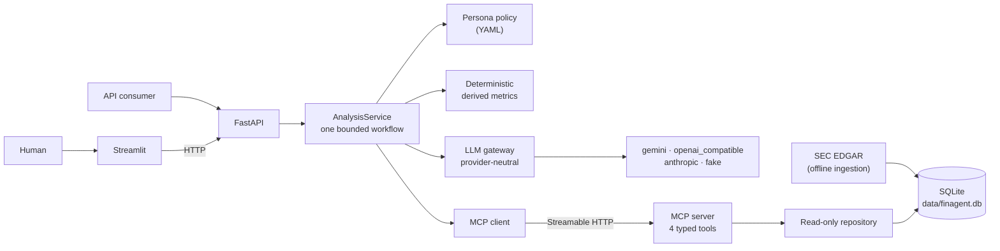

# FinAgent

One persona-configurable financial-research agent. It answers questions as a
**Mutual Fund**, **Equity**, or **Private Equity** analyst about **Technology**,
**Retail**, or **Logistics** companies, grounded in an SEC-sourced SQLite dataset
that it reaches only through **MCP** tools. The same agent serves a Streamlit UI
and a JSON API, and works with Gemini, OpenAI-compatible endpoints, Anthropic,
or an offline fake provider, switched entirely through `.env`.



## Quick start

Requires Python 3.11+ and [uv](https://docs.astral.sh/uv/). The real SEC
database is committed, so nothing needs downloading.

```bash
uv sync --extra test
cp .env.example .env            # add one API key (see "LLM providers"), or set LLM_PROVIDER=fake
make demo                       # starts MCP (8001), API (8000), and Streamlit (8501)
```

Or in three terminals: `uv run finagent-mcp`, `uv run finagent-api`,
`uv run streamlit run ui/app.py`. Verify with `uv run pytest` (offline, no key).

API example:

```bash
curl -sS http://127.0.0.1:8000/v1/analyses \
  -H 'Content-Type: application/json' \
  -d '{"query": "Which companies look like attractive buyout targets?",
       "persona": "pe_analyst", "sector": "logistics"}'
```

`LLM_PROVIDER=fake` runs with no key and no network: it returns the retrieved
evidence tabulated under the persona's sections but makes no analytical
judgement, and says so. Use a real provider to see persona reasoning.

## How an analysis runs

Every request, from either interface, walks the same bounded state machine
(`core/state.py`); the states visited are returned in `trace.states`.

1. **resolving_scope** — `get_catalog` and `resolve_companies` run in parallel
   over MCP. Company names, tickers, and aliases are matched deterministically.
   An explicit mention that fails to match gets one constrained LLM attempt that
   can only pick from the sector's catalog at confidence ≥ 0.85; otherwise the
   request ends here as `out_of_scope` **without any planning or synthesis
   call** (`trace.llm_calls == 0`).
2. **planning** — the model proposes a retrieval plan. The application then
   intersects it with the catalog and **adds the persona's required and
   preferred inputs**, so retrieval is deterministic per persona regardless of
   the proposal. Both plans are returned in `trace`.
3. **retrieving** — typed `query_observations` / `query_events` calls over MCP.
4. **calculating** — `core/derived.py` computes the persona's ratios (growth,
   margin change, FCF margin, net debt, leverage, sector-median deltas, FCF
   yield on float) in code. Each value carries the observation and source IDs
   it came from. The model never does arithmetic.
5. **synthesizing** — the model receives the evidence, the derived metrics, and
   a persona-specific system instruction, and returns a structured draft.
6. **validating / repairing** — every finding's `source_ids` and `company_ids`
   are checked against what MCP actually returned. One repair attempt is allowed
   (no new evidence); a still-invalid draft becomes `insufficient_data`.

## Personas: same data, different reasoning

Everything persona-specific lives in
[`src/finagent/config/personas.yaml`](src/finagent/config/personas.yaml); there
are no persona branches in code. A persona changes four things:

| Dimension | Mutual Fund Analyst | Equity Analyst | PE Analyst |
| --- | --- | --- | --- |
| **Required inputs** (decide evidence status) | revenue, operating margin, FCF, + sector medians | revenue, operating income, operating margin | FCF, total debt, cash, capex |
| **Derived metrics** (computed in code) | growth, margin Δ, FCF margin, FCF yield on float, margin & revenue vs sector median | growth, operating-income growth, margin Δ, FCF yield on float | FCF margin, capex intensity, net debt, net debt ÷ FCF, FCF yield on float |
| **Reasoning frame** (system instruction) | benchmark-relative, 3–5 yr durability, portfolio fit; must not give price targets or deal framing | earnings trajectory, margin mechanics in pp, valuation only from evidence; must not invent multiples | cash first, leverage capacity, operational levers, exit; must not present screening as underwriting |
| **Decision output** | core holding / watch / avoid | improving / stable / under pressure | screening target / pass + one-line thesis |

Each persona also has fixed H3 sections the answer must contain. The
`scripts/eval_matrix.py` report measures section presence, persona vocabulary,
and pairwise answer overlap for the same question across personas.

## Data: sources and schema

Twelve companies, four per sector, declared in
[`data/source_manifest.yaml`](data/source_manifest.yaml): AAPL, MSFT, NVDA, ADBE ·
WMT, TGT, COST, HD · UPS, FDX, EXPD, CHRW. Everything comes from SEC EDGAR —
XBRL Companyfacts for financials and the latest 10-K HTML for cover-page and
workforce disclosures — downloaded by an explicit, rate-limited, identified
ingestion command and cached with SHA-256 digests. Nothing is fetched at request
time.

| Table | What it stores | Why it is shaped this way |
| --- | --- | --- |
| `sectors`, `companies`, `company_aliases` | The catalog: canonical IDs (`sec:<CIK>`), tickers, and the aliases deterministic resolution matches on | The catalog is the allowlist every other query is constrained to |
| `annual_financial_snapshots` | One wide row per company-year: revenue, operating income and margin, operating cash flow, capex, FCF, cash, total debt | Wide rows keep year-over-year math trivial and make missing values explicit `NULL`s rather than absent rows |
| `market_snapshots` | Dated `public_float` (10-K cover page) and, where quoted, `share_price`; `market_cap` and `enterprise_value` columns exist but are `NULL` | Public float is the only valuation figure a 10-K states; it is stored under its own name because it excludes insiders and is **not** market cap |
| `operating_signals` | Long rows: `(company, signal_type, observed_at, value)` — currently headcount from 10-K workforce disclosures | Long format because signal kinds vary and are sparse; new kinds need no schema change |
| `sector_benchmarks` | Per-sector medians of the annual metrics, requiring ≥ 3 companies | Gives the Mutual Fund lens a benchmark-relative view without an external index feed |
| `sources`, `source_lineage` | One row per cited filing or Companyfacts document with URL, accession, retrieval date, digest; lineage links each derived median to its input filings | Every fact, signal, and derived value cites a source; only cited sources are kept |
| `dataset_metadata` | Content-hash `dataset_version`, schema and manifest versions | The version is returned in every response |

Every fact row carries `quality_caveat` text (e.g. "regex-extracted from an
annual-report employee disclosure"). Caveats are surfaced as `limitations` but
do not change `evidence_status`; only missing *required* inputs do.

Current build: 36 annual snapshots (FY2023–FY2026 depending on fiscal calendar),
12 public-float disclosures, 12 headcount signals, 24 sector medians, 15 cited
sources. Rebuild with `make db` from the cache or
`uv run python -m finagent.ingestion refresh-public` from EDGAR (needs
`SEC_USER_AGENT`). `uv run python -m finagent.ingestion audit` verifies
provenance integrity.

**Known data-quality caveats**

- Fiscal calendars differ (Microsoft June, Apple September, Walmart January), so
  "latest year" is not the same calendar period across companies. Sector medians
  use each company's latest year.
- XBRL tags are not perfectly comparable across issuers; `total_debt` is
  assembled from long-term and current debt tags and is absent for Expeditors,
  which reports none.
- Headcount is regex-extracted from 10-K text and reflects each issuer's own
  workforce definition.
- No guidance or restructuring events exist yet — 10-Ks do not carry them
  reliably. Personas that want them see the gap in `coverage`.
- There is no market cap, enterprise value, or price feed. PE output is public-
  data screening, not underwriting, and says so.

## MCP design

The agent process never touches SQLite. `tests/backend/test_boundaries.py` fails
if `api/`, `core/`, or `gateways/` import `sqlite3`, or if SQL appears anywhere
outside `mcp_server/repository.py`. The MCP server is a separate process
(`uv run finagent-mcp`) speaking stateless Streamable HTTP with JSON responses,
so any number of API workers can share it; `FINAGENT_MCP_TRANSPORT=stdio` serves
the same tools to MCP Inspector or a desktop client.

Four narrow tools instead of a `run_sql` tool:

| Tool | Purpose |
| --- | --- |
| `get_catalog(sector)` | Entities, metric keys, event kinds, coverage dates, dataset version. Its values are the only ones the other tools accept, so it doubles as the allowlist applied to model-proposed plans. |
| `resolve_companies(sector, query)` | Deterministic name/ticker/alias matching plus detection of an explicit-but-unknown company mention. |
| `query_observations(sector, entity_ids, metric_keys, latest_only, limit)` | Financial, market, and benchmark observations, each with its `source_id`, and the cited `sources` in the same result. |
| `query_events(sector, entity_ids, event_kinds, latest_only, limit)` | Dated operating signals with in-band sources. |

Design choices a client sees when it lists the server: tools return the Pydantic
contracts directly, so each advertises a real `outputSchema` and the SDK
validates `structuredContent`; all four carry `readOnlyHint`, `idempotentHint`,
and `openWorldHint=false` annotations; the server publishes usage
`instructions` and a `finagent://schema` resource with the DDL. Inputs are
canonical IDs (never free text into SQL), every query is parameterized and
sector-scoped, unknown or cross-sector IDs are rejected, and the connection is
opened `mode=ro` with `query_only` on.

The LLM is **not** an MCP client. It receives no tools of any kind; it proposes
a plan as JSON, the application runs the MCP calls, and the model reasons only
over what came back. This keeps every data access deterministic, testable, and
free of prompt-injection paths from data into queries.

## LLM providers

The gateway (`gateways/llm.py`) owns prompts and validation and imports no
vendor SDK; each provider is one adapter behind a single
`complete_structured(request)` seam (`gateways/providers/`).

| `LLM_PROVIDER` | Works with | Extra to install | Notes |
| --- | --- | --- | --- |
| `gemini` | Google Gemini | none (included) | Native JSON-schema output; synthesis uses a thinking budget |
| `openai_compatible` | OpenAI, Groq, Mistral, Together, OpenRouter, DeepSeek, local Ollama / LM Studio / vLLM | `uv sync --extra openai` | Set `LLM_BASE_URL`; falls back to JSON mode on servers without `json_schema` |
| `anthropic` | Claude | `uv sync --extra anthropic` | Native structured output |
| `fake` | nothing | none | Deterministic evidence digest, used by the test suite |

```dotenv
LLM_PROVIDER=gemini
LLM_MODEL=gemini-3.5-flash-lite
LLM_API_KEY=...                        # GEMINI_API_KEY / OPENAI_API_KEY / ANTHROPIC_API_KEY also accepted
LLM_BASE_URL=                          # openai_compatible only
```

Gemini Flash-Lite has a free tier whose prompts may be used by Google to
improve its products, so send this demo only public information. The API binds
to loopback and has no authentication; a public deployment would need both.

## API

```http
POST /v1/analyses          {query, persona, sector} -> AnalysisResponse
POST /v1/analyses/stream   same body; server-sent events: one `step` per workflow
                           state, then `result` (the same AnalysisResponse) or `error`
GET  /v1/catalog?sector=   personas, sectors, companies, metric keys, coverage
GET  /health/live · /health/ready
```

The Streamlit page consumes the stream, so the agent's workflow is visible
while it runs: each state appears as a timeline step with a one-line summary
("Resolved 4 of 4 companies", "Model proposed 3 metrics; running 6", "Computed
24 derived metrics", "All 6 findings grounded in 5 sources"), and the planning
step shows the model's proposal next to what the application actually ran.

`AnalysisResponse` (schema 1.1) is built for programmatic consumers:

| Field | Meaning |
| --- | --- |
| `status` | `answered`, `out_of_scope`, or `insufficient_data` — all HTTP 200; they are analytical outcomes, not errors |
| `answer_markdown` | The persona's answer with its required sections |
| `findings[]` | Material claims, each with the `company_ids` and `source_ids` that support it; validated against `sources` |
| `derived_metrics[]` | Application-computed values with formula and input lineage |
| `companies[]`, `sources[]` | Everything referenced, with URLs and dates |
| `evidence_status` + `coverage` | **This is the "confidence" field.** `sufficient` only when every persona-required metric returned an observation; `coverage.missing_metrics` names the gaps. A calibrated self-reported LLM confidence would be fiction, so none is offered. |
| `data_as_of`, `limitations[]` | Latest evidence date; caveats and gaps in plain language |
| `trace` | States visited, model-proposed vs application-run plan, repair flag, LLM call count, dataset version |

Invalid input → 422, upstream rate limit → 429, MCP/LLM unavailable → 503,
deadline exceeded → 504, all as RFC 7807 Problem Details with `X-Request-ID`.

## Verification

```bash
uv run pytest                    # 113 tests, offline; includes a real MCP server subprocess
uv run pytest -m integration     # only the real-transport tests
make lint
uv run python scripts/eval_matrix.py   # against a running API -> docs/EVAL.md
RUN_LIVE_GEMINI_TEST=1 uv run --env-file .env pytest -m live   # one opt-in real call
```

The suite proves the architecture rather than snapshotting prose: import
boundaries, state transitions, that an unknown company exits before any LLM
call, that model-proposed identifiers outside the catalog never reach MCP, that
persona-required inputs are always retrieved, grounding validation, derived
metric arithmetic, every provider adapter against stubbed SDK calls, all four
tools over real MCP Streamable HTTP with typed schemas and annotations, SEC caching
and idempotent builds, and a headless render of the UI.

## Write-up

**Schema decisions.** The schema is purpose-built for the questions the personas
ask, not a generic financial warehouse. Wide annual rows make the arithmetic the
personas need (growth, margins, leverage) a matter of two rows, and make gaps
explicit `NULL`s that the coverage logic can name. Signals are long because they
are sparse and heterogeneous. Provenance is first-class: every fact cites a
`sources` row, derived medians keep lineage to their inputs, and the build prunes
uncited sources so the shipped database is small and every row in it is
reachable from an answer. The one deliberate non-obvious choice is `public_float`:
10-K covers state it, market cap they do not, and labelling one as the other
would be exactly the fabrication the agent is built to avoid.

**MCP design.** MCP is the only path to data, enforced by tests rather than
convention. The tool surface is intentionally narrow and typed: a catalog that
doubles as an allowlist, deterministic entity resolution, and two query tools
that return provenance in-band. The model proposes; the application disposes.
That split — visible in every response's `trace` — is what makes the system
auditable: nothing the model says can turn into a query the catalog does not
permit, and nothing it cites can be a source MCP did not return.

**What I would improve with more time.** A licensed price and shares-outstanding
feed so PE and Equity lenses can discuss real enterprise value; hand-curated,
URL-cited guidance and restructuring events from 8-K exhibits so the event
tools carry more than headcount; section-level grounding (each H3 must cite at
least one finding) rather than answer-level; and an LLM-judge eval of persona
differentiation on top of the lexical overlap score in `scripts/eval_matrix.py`.

## Repository layout

```text
src/finagent/
  api/             FastAPI adapter, Problem Details errors
  config/          personas.yaml — the only persona-specific artifact
  contracts/       Public API and MCP Pydantic models
  core/            AnalysisService, state machine, derived metrics, grounding
  gateways/        Provider-neutral LLM gateway, providers/, MCP client
  ingestion/       SEC downloader, offline builder, audit, sample data
  mcp_server/      MCP tools and the only runtime SQLite access
ui/                Streamlit page and its HTTP-only client
scripts/           eval_matrix.py
data/              source_manifest.yaml and the committed finagent.db
docs/              DESIGN.md, IMPLEMENTATION_PLAN.md, Mermaid sources
```

Educational software, not investment advice.
