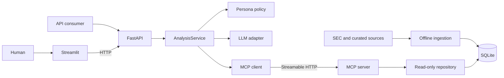

# FinAgent Assignment

A deliberately small, auditable financial-research agent scaffold. One bounded
analysis workflow supports Mutual Fund, Equity, and Private Equity personas
across Technology, Retail, and Logistics. Runtime data access is isolated behind
four typed Model Context Protocol (MCP) tools, and both the Streamlit UI and
external consumers use the same FastAPI contract.

This repository now contains an executable vertical slice: FastAPI calls the
bounded analysis service, which reaches a separate MCP Streamable HTTP process
and a read-only SQLite database. The integration suite proves that boundary
with deterministic fixture data and a fake LLM. A production model adapter and
curated market/benchmark records remain later milestones.

## Architecture



The full architecture, finite-state workflow, and API sequence are documented
in [docs/DESIGN.md](docs/DESIGN.md). Standalone Mermaid sources are under
[docs/diagrams](docs/diagrams), and the dependency-ordered delivery plan is in
[docs/IMPLEMENTATION_PLAN.md](docs/IMPLEMENTATION_PLAN.md).

## Design constraints

- One configurable agent workflow; no persona-specific implementations.
- Persona and sector are independent validated inputs.
- Streamlit calls FastAPI and contains no agent or database logic.
- The analysis service obtains runtime data only through MCP.
- Only `mcp_server/repository.py` and offline ingestion code access SQLite.
- No arbitrary/model-generated SQL and no runtime web scraping.
- Scope resolution occurs before synthesis, so unsupported companies return an
  honest `out_of_scope` result without calling the LLM.
- Model-produced findings must reference sources returned by MCP.

## Repository layout

```text
src/finagent/
  api/             FastAPI adapter and Problem Details errors
  config/          Declarative persona policies
  contracts/       Public API and MCP Pydantic models
  core/            Bounded AnalysisService and grounding rules
  gateways/        LLM and MCP client adapters
  ingestion/       Explicit SEC downloader and offline DB builder
  mcp_server/      MCP tools and read-only SQLite repository
ui/                Thin Streamlit HTTP client
data/              Curated source manifest; raw data is ignored
tests/             Backend, repository, boundary, and ingestion tests
docs/              Design, implementation plan, and Mermaid sources
```

## Setup

Python 3.11 or newer and [uv](https://docs.astral.sh/uv/) are recommended.

```bash
uv sync --extra test
```

Copy `.env.example` for reference, but export variables in the shell that starts
each process. Never commit a real key or personal `.env` file.

## Build the sector database

SEC downloads are explicit and never occur during an API request. SEC fair
access requires an identifying user agent containing a real application or team
name and contact email.

```bash
export SEC_USER_AGENT="finagent-assignment/0.1 your-email@example.com"

# Download all 12 curated companies, or add --sector/--ticker to narrow it.
uv run python -m finagent.ingestion download

# This step is offline and builds SQLite atomically from the cache.
uv run python -m finagent.ingestion build --output data/finagent.db
```

The curated universe is defined in [data/source_manifest.yaml](data/source_manifest.yaml).
Raw downloads and generated databases are intentionally ignored; fixture data
under `tests/ingestion/fixtures` keeps CI deterministic.

The initial SEC adapter builds annual financial snapshots and headcount signals.
Market snapshots, benchmark values, and additional IR-derived operating signals
use the same schema but still require curated adapters/data before the final
submission. Missing fields remain missing; the agent must return partial or
insufficient-data outcomes instead of inventing them.

## Run the services

After building `data/finagent.db`, start each process in a separate terminal:

```bash
uv run finagent-mcp
```

```bash
uv run finagent-api
```

```bash
uv run streamlit run ui/app.py
```

Defaults:

- MCP: `http://127.0.0.1:8001/mcp`
- API: `http://127.0.0.1:8000`
- Streamlit: `http://localhost:8501`

The default API uses `FakeLlmGateway`, a deterministic source-linked adapter for
tests and system demonstrations. It does not provide substantive investment
analysis.

## API

```http
POST /v1/analyses
GET  /v1/catalog?sector=tech
GET  /health/live
GET  /health/ready
```

Example request:

```bash
curl -sS http://127.0.0.1:8000/v1/analyses \
  -H 'Content-Type: application/json' \
  -d '{
    "query": "What is the latest headcount signal for Adobe?",
    "persona": "equity_analyst",
    "sector": "tech"
  }'
```

Valid analytical outcomes (`answered`, `out_of_scope`, and
`insufficient_data`) use HTTP 200. Invalid inputs use 422; unavailable runtime
dependencies use 503; a global analysis deadline uses 504.

## MCP tools

- `get_catalog`
- `resolve_companies`
- `query_observations`
- `query_events`

The tools accept canonical, sector-scoped inputs and return structured facts or
events with their source metadata. SQLite is opened in read-only/query-only
mode by the MCP service.

## Verification

```bash
uv run pytest
uv run pytest -m integration
python -m compileall -q src tests ui
git diff --check
```

The integration marker starts the real MCP HTTP server on an ephemeral
localhost port and requires no network access, API key, or prebuilt database.

The current tests cover:

- typed API and MCP contracts;
- bounded state transitions;
- source-link grounding;
- deterministic out-of-scope and insufficient-data outcomes;
- latest headcount selection;
- real MCP SDK calls across all four tools over Streamable HTTP;
- the complete API -> analysis -> MCP -> read-only SQLite path;
- unknown-company early exit before any LLM planning or synthesis call;
- rejection of unknown and cross-sector entity identifiers;
- purpose-built schema-to-MCP mapping;
- architectural import boundaries;
- SEC identity, rate limiting, caching, and idempotent offline builds; and
- the UI's HTTP-only client behavior.

## Data-quality caveats

- Company fiscal calendars and XBRL tags are not perfectly comparable.
- EBITDA is not consistently reported as a standardized GAAP fact.
- Headcount definitions vary and may represent a filing-period snapshot.
- The initial SEC-only build does not create current price, market-cap, or
  benchmark observations.
- PE output must be described as preliminary public-data screening, not full
  transaction underwriting.

This project is educational software, not investment advice.
