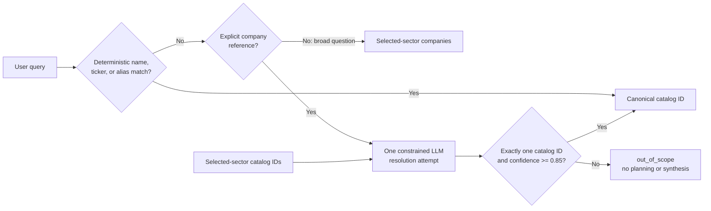
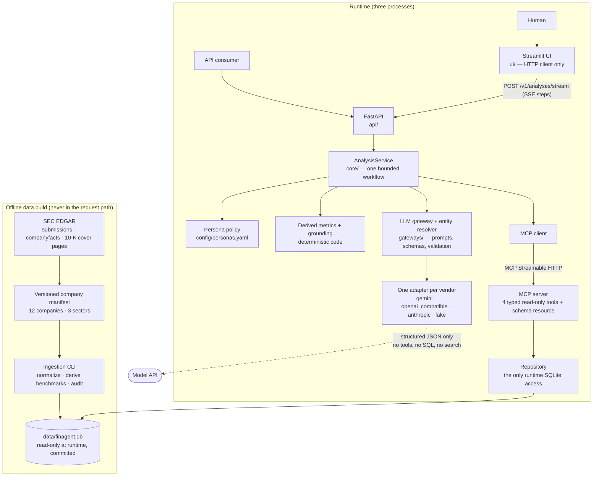
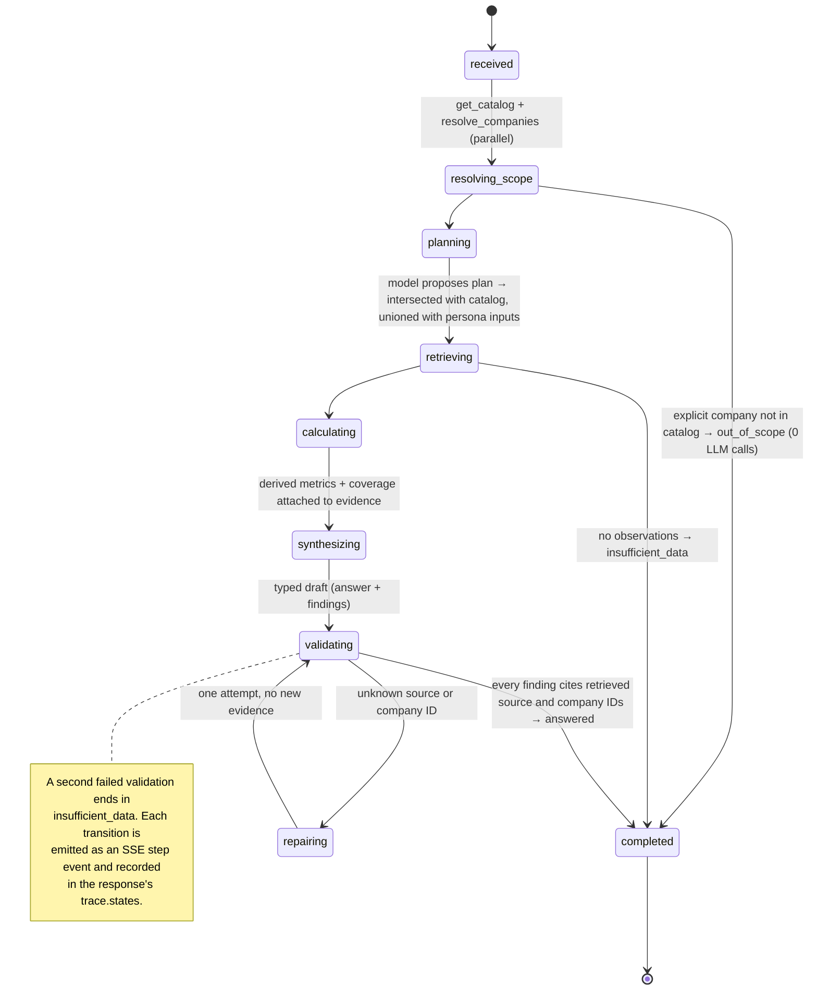
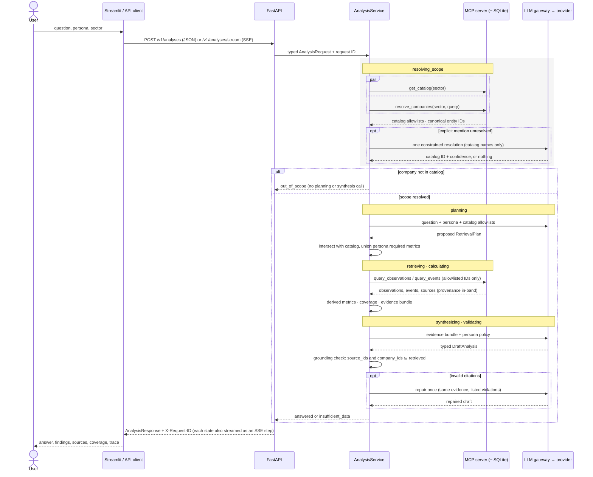

# Financial Research Agent - Design

## Design objective

Build the smallest auditable vertical slice that proves five properties:

1. One agent workflow serves both human and API clients.
2. Runtime data access crosses a real MCP boundary.
3. Persona and sector are independent configuration dimensions.
4. Persona changes evidence requirements and analysis structure, not only tone.
5. Unsupported or weakly supported questions fail honestly.

The design intentionally favours provenance, deterministic control, and tests
over data breadth. Technology, Retail, and Logistics each contain a small,
curated company universe with roughly a few dozen sourced domain records.

## Architectural decisions

### One configurable workflow

Mutual Fund, Equity, and Private Equity are declarative policies consumed by
one `AnalysisService`. There are no persona-specific services and no
persona-sector configuration matrix.

### FastAPI is the canonical interface

Streamlit is a thin HTTP client. External clients and the UI therefore execute
the same validation, orchestration, retrieval, and grounding path.

### MCP is an enforced data boundary

The application service accesses data only through a typed MCP client. Only the
MCP repository and offline ingestion packages may import SQLite. Architecture
tests enforce this rule.

### Offline, reproducible ingestion

External sources are downloaded and normalized outside the request path. The
runtime reads a locally built SQLite database, so a demonstration never depends
on live scraping.

### Bounded orchestration

The workflow has explicit states, no model-generated SQL, no autonomous web
search, and at most one constrained output repair. Derived financial ratios are
calculated by deterministic code before LLM synthesis.

### The LLM is a constrained, provider-neutral reasoning adapter

The gateway uses the model for three typed operations: proposing a small
retrieval plan, synthesizing a source-linked draft, and repairing one invalid
draft. The model receives no MCP, search, URL, SQL, or function tools.
`AnalysisService` intersects every proposed entity, metric, and event with the
MCP catalog and unions in the persona's required inputs before performing the
queries itself. After synthesis, deterministic validation rejects company or
source identifiers that were not present in retrieved evidence.

Prompt composition and validation live in one gateway that imports no vendor
SDK; vendors are one-file adapters behind a single structured-completion seam
(Gemini, any OpenAI-compatible endpoint, Anthropic, and an offline fake).
Switching providers is a `.env` change.

### Entity resolution is deterministic first

The MCP repository first matches normalized legal names, tickers, and configured
aliases. If that fails, its narrow phrasing detector distinguishes an explicit
company mention from a broad sector question. Only an explicit unresolved mention
may invoke the typed LLM resolver, which receives the selected sector's company
catalog and no data tools. `AnalysisService` accepts exactly one catalog ID at
confidence `>= 0.85`; ambiguous, low-confidence, invented, malformed, timed-out,
or unavailable results exit as `out_of_scope` before planning and synthesis.

Fuzzy-search dependencies, embeddings, and unrestricted model-driven entity
discovery are not part of this design.

### Evidence coverage over subjective confidence

Responses report evidence status, dates, sources, unsupported-claim counts, and
limitations. They do not expose an uncalibrated LLM confidence score or hidden
chain-of-thought.

## Overall architecture

The inline diagram is a verbatim copy of
[`diagrams/architecture.mmd`](diagrams/architecture.mmd).

## Agent state machine

State names match `AnalysisState` in `core/state.py`; the sequence visited is
returned in every response's `trace.states`. A second failed validation ends in
`insufficient_data`.

The inline diagram is a verbatim copy of
[`diagrams/agent-state-machine.mmd`](diagrams/agent-state-machine.mmd).

## API and MCP sequence

The inline diagram is a verbatim copy of
[`diagrams/api-sequence.mmd`](diagrams/api-sequence.mmd).

## Runtime contracts

The public API exposes:

- `POST /v1/analyses` — one JSON `AnalysisResponse`
- `POST /v1/analyses/stream` — the same run as Server-Sent Events: one `step`
  event per state transition, then `result` (or `error`)
- `GET /v1/catalog`
- `GET /health/live`
- `GET /health/ready`

The MCP server exposes four typed, read-only tools (plus a `finagent://schema`
resource with the dataset DDL):

- `get_catalog`
- `resolve_companies`
- `query_observations`
- `query_events`

Every observation or event carries its source metadata in the same tool result.
The service returns `answered`, `out_of_scope`, or `insufficient_data` as domain
outcomes and separately reports evidence as `sufficient`, `partial`, or `none`.

## Data model

The purpose-built schema contains:

- sectors;
- companies;
- annual financial snapshots;
- market snapshots;
- operating signals;
- sector benchmarks; and
- sources plus derived-source lineage.

Public-data refresh is an explicit ingestion operation. SEC submissions,
Companyfacts, and accession-specific annual filings are cached with hashes and
retrieval metadata. Database construction and auditing then run offline. Sector
benchmarks are medians of at least three current SEC-backed company records;
their derived source retains links to each constituent source.

Each factual row stores the reporting/effective date, publication date, source,
unit or currency where applicable, and a quality caveat. The sample database is
generated from a versioned source manifest and cached raw inputs.

## Explicit non-goals for the first milestone

- Authentication or user accounts.
- Persistent chat memory.
- Streaming model tokens (workflow *steps* are streamed; tokens are not).
- Runtime scraping or autonomous web browsing.
- Vector databases or document RAG.
- Arbitrary SQL tools.
- Real-time market feeds.
- Full LBO underwriting or calibrated investment advice.
- Separate persona agents or sector-specific workflows.

## Proof strategy

Tests must demonstrate the architecture rather than snapshot fluent prose:

- all nine persona-sector combinations are accepted;
- persona outputs apply different required analysis dimensions;
- unknown companies exit before LLM synthesis;
- the latest headcount signal is selected deterministically;
- every finding references evidence returned by MCP;
- only the MCP repository and ingestion code import SQLite;
- Streamlit calls the API rather than importing the agent; and
- the real MCP client/server transport works against a temporary database.
